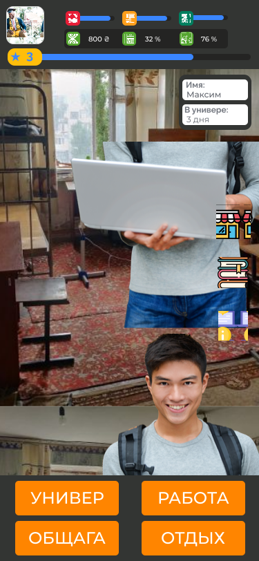

# kpi_student

Le jeu nous amène au début de la vie étudiante. Vous commencerez comme un simple étudiant avec pas une grosse somme d'argent dans la nouvelle ville, qui n'est pas prête pour de nouveaux visiteurs.
Le jeu contient:

- logical puzzles
- strategic elements
- intrigue perplexe
- pas définitivement des solutions
- fortune
- a bit of mystery
- beaucoup d'étude
- et beaucoup plus

Pourriez-vous survivre à tous ses défis? Le KPI et ses auberges vous attendent.

### Démo de jeu

_The main page of screen_

_Exemple de menu de jeu_

## Conditions

Pour démarrer une aventure, vous avez besoin d'un navigateur moderne avec**JavaScript support**Et rien de plus.

## Dépendances

Nous dépendons de[Réagir](https://reactjs.org/)bibliothèque

## FAQ

Pas de question pour le moment.: Déçu:

## Contribuant

Nous apprécions votre aide!

Pour contribuer, veuillez lire les directives de contribution à l'adresse[CONTRIBUTING.md](CONTRIBUTING.md)

## LICENCE

En utilisant du code dans ce référentiel, vous acceptez toutes les déclarations de[Fichier LICENCE](LICENSE)

## Traduction README

<!-- TODO: add russian and ukrainian translation  -->

- [Anglais](READMEs/README.md)
- [Chinois simplifié](READMEs/README.zh-CN.md)
- [繁体中文](READMEs/README.zh-TW.md)
- [hindi](READMEs/README.hi.md)
- [Française](READMEs/README.fr.md)
- [arabe](READMEs/README.ar.md)
