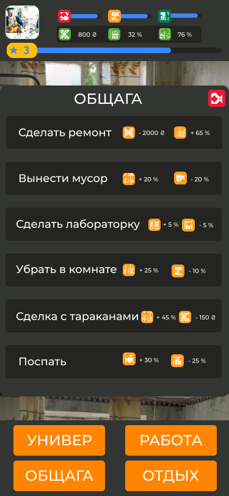

# kpi_student

खेल हमें छात्र जीवन की शुरुआत में लाता है। आप एक साधारण छात्र के रूप में नए शहर में एक बड़ी राशि के साथ शुरू करेंगे, जो नए आगंतुकों के लिए तैयार नहीं है।
खेल में शामिल हैं:

-   तार्किक पहेली
-   रणनीतिक तत्व
-   हैरान कर देने वाली साजिश
-   निश्चित रूप से समाधान नहीं
-   भाग्य
-   थोड़ा सा रहस्य
-   बहुत अध्ययन किया
-   और भी बहुत कुछ

आप यह सब चुनौतियों से बच सकता है? KPI और उसके हॉस्टल आपकी प्रतीक्षा कर रहे हैं।

### खेल खेलने का डेमो

_स्क्रीन का मुख्य पृष्ठ_

_खेल मेनू का उदाहरण_

## आवश्यकताओं को

To start an adventure you need a modern browser with **जावास्क्रिप्ट का समर्थन**और कुछ नहीं।

## निर्भरता

हम पर निर्भर हैं[प्रतिक्रिया](https://reactjs.org/)पुस्तकालय

## सामान्य प्रश्न

No question at this moment.:disappointed:

## योगदान

हम आपकी मदद के आभारी हैं!

योगदान करने के लिए, कृपया योगदान दिशानिर्देशों को पढ़ें[कंट्रिब्यूटिंग.मद](CONTRIBUTING.md)

## लाइसेंस

इस भंडार में कोड का उपयोग करके, आप सभी कथनों से सहमत हैं[LICENSE फ़ाइल](LICENSE)
