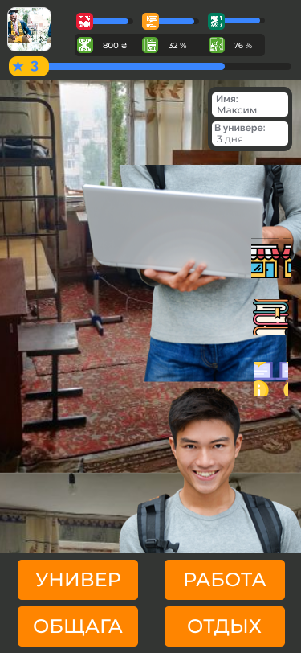

# kpi_student

遊戲將我們帶入了學生生活的起點。您將以一個簡單的學生開始，在這個新城市裡沒有很多錢，這還不適合新來的遊客。
遊戲包含：

-   邏輯難題
-   戰略要素
-   困惑的情節
-   不一定是解決方案
-   財富
-   有點神秘
-   很多研究
-   以及更多

您能克服所有挑戰嗎？ KPI和他的旅館正在等待您。

### 遊戲示範

_屏幕首頁_

_遊戲菜單示例_

## 要求

要開始冒險，您需要具有以下功能的現代瀏覽器：**JavaScript支持**僅此而已。

## 依存關係

我們依靠[反應](https://reactjs.org/)圖書館

## 常問問題

目前沒有問題。：失望：

## 貢獻

感謝您的幫助！

要捐款，請閱讀以下網址的捐款準則：[contributing.面對](CONTRIBUTING.md)

## 執照

通過使用此存儲庫中的代碼，您同意其中的所有語句[許可文件](LICENSE)

## README Translation

-   [英語](README.md)
-   [簡體中文](README.zh-CN.md)
-   [繁體中文](README.zh-TW.md)
-   [印地語](README.hi.md)
-   [法語](README.fr.md)
-   [阿拉伯](README.ar.md)
